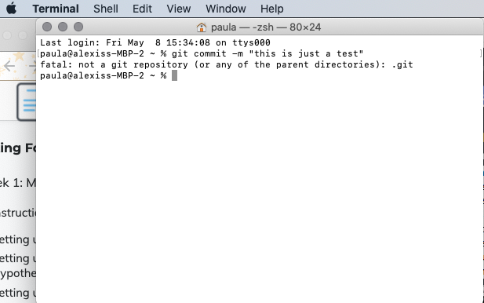

#Demo help request - Entering commands in the terminal

While working on the Asking for Help section in Week One, I opened the terminal and input *git commit -m "this is just a test"*. But, I got an error message:

 

After looking up the error message, I read on [Stackoverflow](https://stackoverflow.com/questions/20413459/fatal-not-a-git-repository-or-any-of-the-parent-directories-git) and [Datree.io](https://www.datree.io/resources/git-error-fatal-not-a-git-repository) that this message means that I haven't entered the command in the directory of a git repo. How do I go about entering this into the correct directory?
